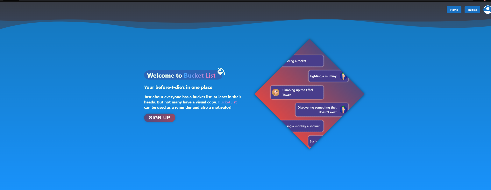

	

# Table of Contents

- [Table of Contents](#table-of-contents)
- [Bucket List](#bucket-list)
- [Technologies Used](#technologies-used)
- [Screenshot](#screenshot)
- [Contributors](#contributors)

# Bucket List

The Bucket List app allows the user to make a list of all the things they dream to accomplish, acquire, or experience! The best part is that the user can check things off their list as they complete them! Just about everyone has a bucket list, at least in their heads, but not many have a visual copy. The bucket list app can be used as a reminder and also as motivation! This application serves all audiences, no limitations to who can dream or how! The application also has the capability of accepting and processing donations through the use of Stripe payment

# Technologies Used

- MERN Stack
- NextJS (React Framework)
- Mantine (component library)
- Framer Motion (animation library)
- NextAuth (authentication)
- GraphQL + Apollo
- Mongoose ODM
- Stripe API
- SCSS

# Screenshot

# Contributors

[Krushil Naik](https://github.com/krushilnaik), [Minha Kim](https://github.com/minha619), [Stephanie Plaza](https://github.com/splaza28)
